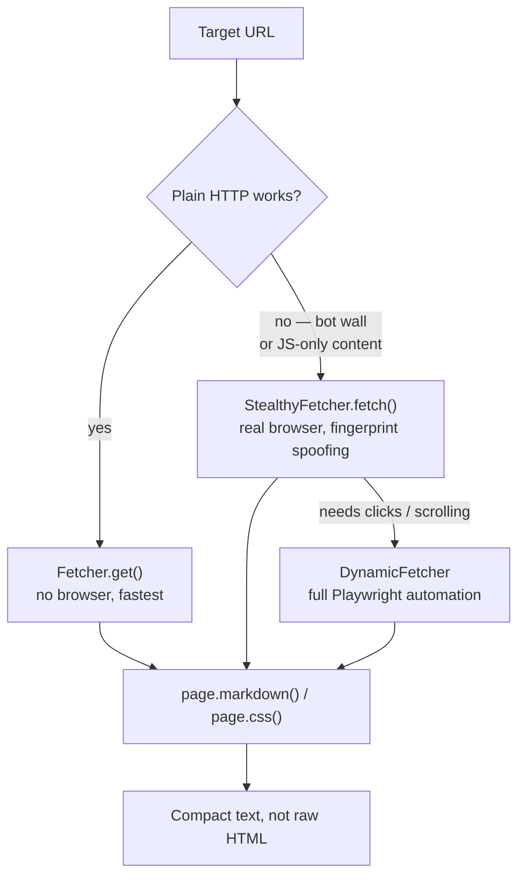
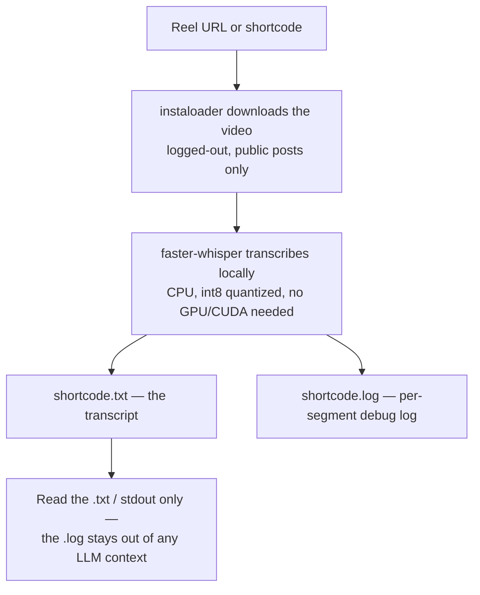

# web-scraping-toolkit

Two self-contained local tools for pulling content from the web that a plain
HTTP fetch can't reach on its own — bot-walled or JS-rendered pages, and
Instagram reels (which expose no fetchable caption track the way YouTube
does). Each tool has its own isolated Python venv and its own README with
full setup/usage detail.

Also registered as a personal Claude Code skill
(`~/.claude/skills/web-scraping-toolkit/`) so a Claude session knows to reach
for these automatically when a plain fetch comes back empty or blocked.

## Tools

| Folder | What it does |
|---|---|
| [`scrapling-scraper/`](scrapling-scraper/) | Fetches pages that block plain requests — Cloudflare/bot-detection walls, client-side-rendered SPAs — via a stealth browser, and extracts markdown/CSS instead of raw HTML. |
| [`ig-reel-transcript/`](ig-reel-transcript/) | Downloads a public Instagram reel and transcribes its audio locally (CPU, no API, nothing uploaded anywhere). |

## Workflow: scrapling-scraper



## Workflow: ig-reel-transcript



## Setup

Each tool is self-contained — see its own README for exact commands:

```
cd scrapling-scraper && python -m venv .venv && .venv\Scripts\pip.exe install -r requirements.txt && .venv\Scripts\scrapling.exe install
cd ig-reel-transcript && python -m venv .venv && .venv\Scripts\pip.exe install -r requirements.txt
```

## Status

Private, personal-use tooling. Built and verified working 2026-09-02.
