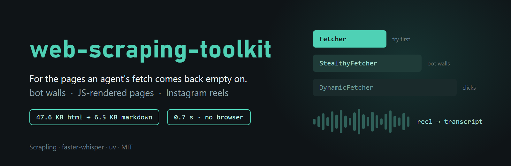

<p align="center">
  
</p>

<p align="center">
  <a href="LICENSE"></a>
  <a href="#install--quickstart">=3.10" /></a>
  <a href="#install--quickstart"></a>
  <a href="#status"></a>
  <a href="https://github.com/sponsors/Arman-no"></a>
</p>

<p align="center">
  <strong>Two small tools for the web content an AI agent's built-in fetch can't get: pages behind bot walls or rendered by JavaScript, returned as compact markdown, and Instagram reels, transcribed locally.</strong>
</p>

<p align="center">
  <a href="#the-problem">The problem</a> &middot;
  <a href="#what-you-get">What you get</a> &middot;
  <a href="#how-it-works">How it works</a> &middot;
  <a href="#install--quickstart">Install</a> &middot;
  <a href="#responsible-use">Responsible use</a> &middot;
  <a href="#status">Status</a> &middot;
  <a href="#faq">FAQ</a>
</p>

---

| Tool | What it does |
|---|---|
| [`scrapling-scraper/`](scrapling-scraper/) | Fetches pages that block plain requests (bot walls, Cloudflare, client-side-rendered apps) and extracts markdown or CSS matches instead of raw HTML. |
| [`ig-reel-transcript/`](ig-reel-transcript/) | Downloads a public Instagram reel and transcribes its audio on your CPU. No API, nothing uploaded. |

**Handing this to a Claude Code agent or a colleague?** Point them at
[`AGENT_SETUP.md`](AGENT_SETUP.md): the rules, install steps and a symptom-to-fix
table, written for an agent to follow directly.

## The problem

An agent's built-in fetch fails on two kinds of target. A bot-walled or
JavaScript-rendered page comes back as an empty shell or a 403. An Instagram reel has
no caption track at all, unlike YouTube, so there is no text to return, only audio.
When a fetch does work, it often hands back the whole HTML page, and most of that is
markup the agent pays for in context and never reads.

## What you get

- **An escalation ladder, not one heavy browser.** Plain HTTP first, a stealth browser
  only when the page needs it, full browser automation only for clicks and scrolling.
- **Markdown, not HTML.** A real Microsoft Learn page: 47.6 KB of HTML became 6.5 KB of
  markdown, fetched in 0.7 s without a browser.
- **Reel transcripts that stay on your machine.** Whisper runs locally on CPU; the
  transcript goes to stdout and a file, the segment log stays out of the agent's context.
- **Pinned, reproducible installs.** Each tool is its own uv project with a `uv.lock`,
  so `uv sync` gives everyone the same tested versions.
- **Registered as a Claude Code skill**, so a session reaches for it by itself when a
  plain fetch comes back empty. See [the spec](docs/SPEC.md#9-claude-code-skill-integration).

## How it works


```mermaid
flowchart LR
    A[URL] --> B{plain fetch<br/>worked?}
    B -- yes --> Z([use it])
    B -- no --> C[Fetcher<br/>plain HTTP]
    C -- empty / 403 --> D[StealthyFetcher<br/>real browser]
    D -- needs clicks --> E[DynamicFetcher<br/>automation]
    C --> M[page.markdown&#40;&#41;<br/>or page.css&#40;...&#41;]
    D --> M
    E --> M
    R[reel URL] --> I[instaloader<br/>download] --> W[faster-whisper<br/>on CPU] --> T[transcript<br/>on stdout]
```

Measured with `Fetcher.get()` on 2026-09-30:

| Page | Status | Time | HTML | Markdown |
|---|---|---|---|---|
| learn.microsoft.com, Power Automate overview | 200 | 0.7 s | 47.6 KB | 6.5 KB |
| docs.astral.sh/uv | 200 | 0.5 s | 78.6 KB | 11.8 KB |

## Install & quickstart

Requires [uv](https://docs.astral.sh/uv/getting-started/installation/).

```bash
git clone https://github.com/Arman-no/web-scraping-toolkit.git
cd web-scraping-toolkit/scrapling-scraper
uv sync                          # installs the pinned versions
uv run scrapling install         # browser binaries, only for StealthyFetcher/DynamicFetcher
uv run python example.py         # smoke test: status 200 and a page title
```

Real use means a short script against the library, starting at the bottom of the ladder:

```python
from scrapling.fetchers import Fetcher, StealthyFetcher

page = Fetcher.get(url)                             # plain HTTP, try first
page = StealthyFetcher.fetch(url, headless=True)    # bot walls, JS-rendered content
print(page.markdown())                              # compact text, not raw HTML
```

Transcribing a reel:

```bash
cd ig-reel-transcript
uv sync
uv run python transcribe_reel.py https://www.instagram.com/reel/SHORTCODE/
uv run python transcribe_reel.py SHORTCODE --model base
```

Model sizes are `tiny`, `base`, `small` (default), `medium` and `large-v3`. The
transcript goes to stdout and to `downloads/<shortcode>/<shortcode>.txt`. Weights
download on first use and are cached afterwards.

On a locked-down Windows machine, keep the venv outside the repo with
`UV_PROJECT_ENVIRONMENT`. See [`AGENT_SETUP.md`](AGENT_SETUP.md#locked-down-windows-applocker).

## Responsible use

These tools fetch content from services that didn't invite the request. The code makes
none of the following decisions for you.

- **Respect site terms and `robots.txt`.** Nothing here checks them automatically.
- **Bot evasion is a deliberate act.** Rendering JavaScript a plain client can't run is
  an ordinary workaround. Getting past an access control that has refused you is not.
- **Rate-limit yourself.** Neither tool has delays or backoff. One target at a time,
  with pauses; Instagram throttles an IP that hits it repeatedly, and it is right to.
- **Don't collect personal data.** No profiles, no contact details, no datasets about
  people. Publicly visible doesn't mean lawful to collect; the GDPR still applies.
- **Transcribe only what you have a right to use.** The video and its transcript stay
  the creator's work.

This is not legal advice. Scraping law varies by jurisdiction.

## Status

- **Both tools run on uv** with pinned lock files. A fresh agent given only the
  setup instructions now in `AGENT_SETUP.md` set the scraper up and fetched a page
  without help.
- Deliberately small: no crawler, no scheduler, no bulk mode, no retries, no proxies.
- Windows is the only platform it has run on. The scripts use `pathlib` and nothing
  platform-specific, so macOS and Linux should work, but they are untested.

## FAQ

**Why not just use the agent's own fetch?** Use it first. This is for when it comes back
empty, blocked, or as a JavaScript shell.

**Does it get past every bot wall?** No. Anti-bot systems change, and a page can answer
`200` with a challenge page. Check the content, not only the status.

**Can it transcribe a private reel?** No. It downloads logged out, so only public posts work.

**Is anything sent to a cloud API?** No. Transcription runs on your CPU; the only network
traffic is the page or video download and, on first use, the Whisper weights from Hugging Face.

**Where is the full detail?** [`docs/SPEC.md`](docs/SPEC.md) covers interfaces, exit codes,
failure modes, the dependencies' roles and known limitations.

## Author

**Arman Nouromid** — [armannouromid.com](https://armannouromid.com) ·
[github.com/Arman-no](https://github.com/Arman-no) ·
[linkedin.com/in/arman-nouromid](https://linkedin.com/in/arman-nouromid)

## License

[MIT](LICENSE) — Copyright (c) 2026 Arman Nouromid. Dependencies keep their own
licences; they are installed from PyPI, not redistributed here.
